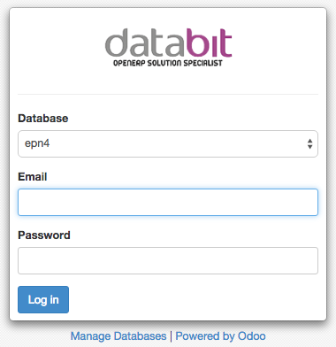
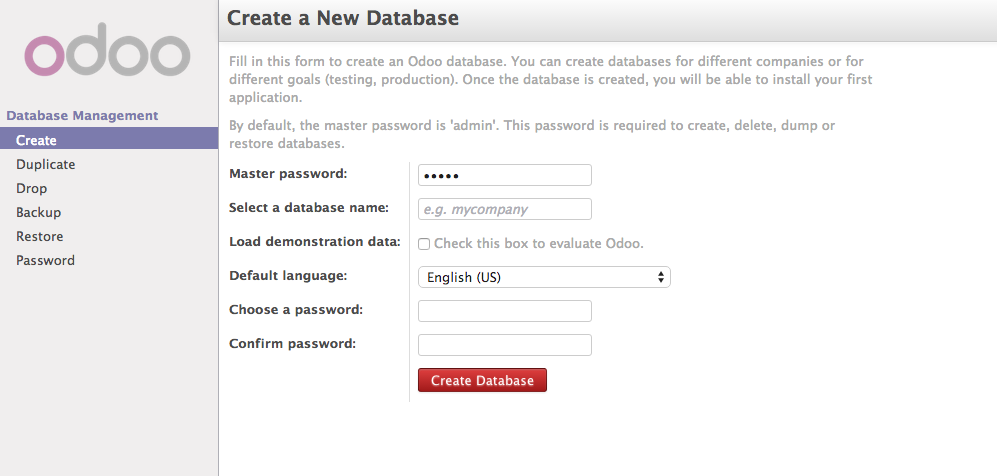
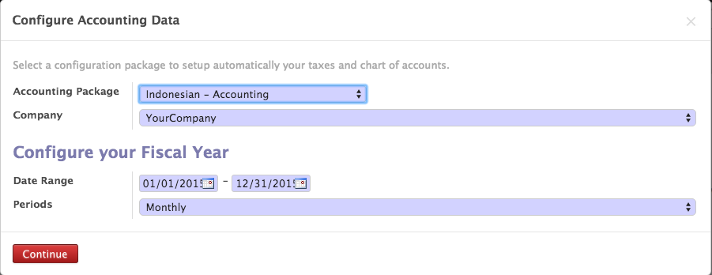
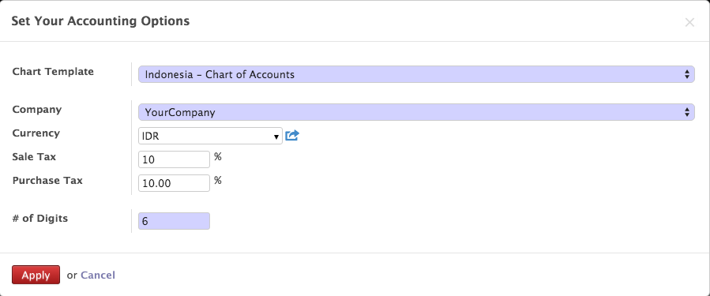
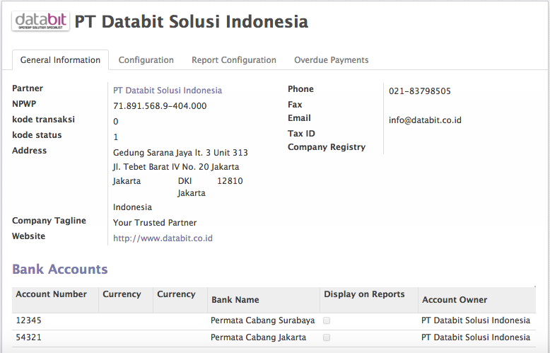
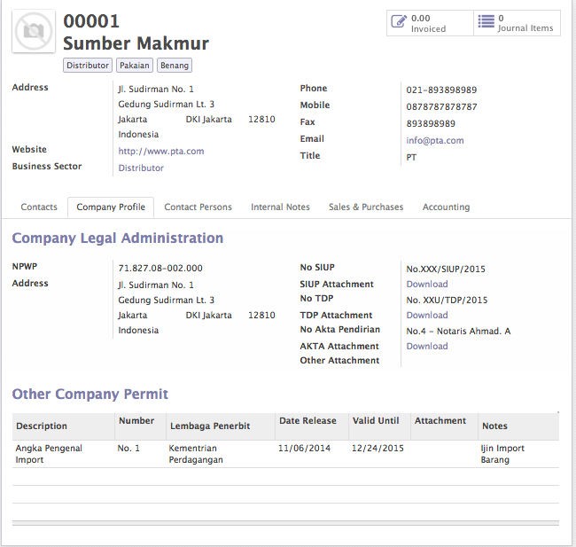
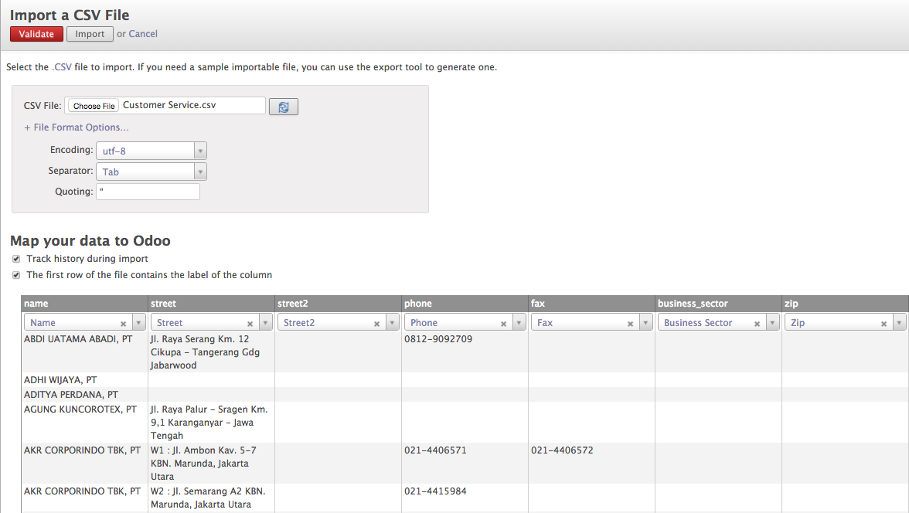

====================================
Membuat Database dan Lakukan Setting
====================================

Login
-----

Setelah menginstall Odoo di Server, kita akan memulai membuat sebuah database.

Membuat Database
----------------

:: 
   
   klik Manage Database > Create
   
   

Isi Master Password, Database Name, Load Demo data, and Choose a Database Password lalu click on create button to create a Database.

Setelah sukses membuat database, install applikasi Accounting pada :

::

   Menu > Setting > Local Module > Accounting
   

Pilih Chart of Account
----------------------

Setelah modul Accounting diinstall, akan mncul tampilan :

klik Apply, lalu akan muncul tampilan :

Lengkapi Data Perusahaan
------------------------

.. note::

   Untuk Pelanggan Odoo-Databit On Demand, Company Setting akan dilakukan oleh Databit Team
   sesuai dengan data yang diterima

Untuk melakukan Company Setting dapat diakses melalui menu :

::

   Menu Settings > Companies > Companies atau klik pada logo Odoo disebelah kiri atas
   
maka akan muncul tampilan seperti ini

::

   Keterangan :
    1. Isi Nama Perusahaan dan masukan logo pada field image
    2. Pada bagian General Information :
       - isi Nomor NPWP
       - kode transaksi (diisin dengan 0)
       - kode status diisi dengan 1, jika merupakan perusahaan umum
       - isi alamat perusahaan
       - isi Company Tagline dengan motto perusahaan jika ada
       - masukan informasi website perusahaan
       - isi nomor telp, fax, dan email perusahaan
    3. Pada Bagian Configuration
       - isi Currency dengan Mata Uang Dasar Perusahaan dalam hal ini : IDR
       

Membuat Data Customer
---------------------

alah satu data yang penting dalam suatu perusahaan ialah Data Customer atau Data Supplier, Oleh karenanya kami menyebutnya
sebagai Master Data Partner.

Untuk memasukan atau menambah data Partner, baik Customer maupun Supplier, pengguna dapat melakukannya dengan cara import data 
melalui file .csv atau menambahkan secara manual.

Untuk menambahkan data secara manual. Berikut langkah yang harus dilakukan :

ntuk menambah Data Customer dapat diakses melalui Menu :

::
   
   Menu > Accounting > Customer > Customer > klik create
   
atau
   
::
   
   Menu > Sales > Sales Order > Customer > klik create
   
maka akan muncul tampilan sebagai berikut :

.. note:: 

    Klik pada 'Is Company' jika Customer merupakan sebuah perusahaan
   
.. tip::

   Tags, diisi dengan Label yang menjadi ciri dari Customer tersebut, misal : Distributor Makanan, Pelanggan Tetap, dll.
   Setiap Customer dapat memiliki lebih dari 1 Tags.
   

Membuat Data Supplier
---------------------

Untuk menambah Data Supplier dapat diakses melalui Menu :

::
   
   Menu > Accounting > Supplier > Supplier > klik create
   
atau
   
::
   
   Menu > Purchase > Purchase Order > Supplier > klik create

Cara pengisian dan Tampilan sama dengan pengisian Data Customer.
   
   
Import Data Customer / Supplier
-------------------------------

Jika Anda suda memiliki data Customer maupun Data Supplier dalam bentuk file csv, maka Odoo menyediakan fasilitas import.

Untuk melakukannya, akses Menu :

:: 

   Menu > .. > Supplier > klik list view > klik import
   
atau

::

   Menu > .. > Customer > klik list view > klik import
   
maka akan muncul tampilan seperti dibawah :

   